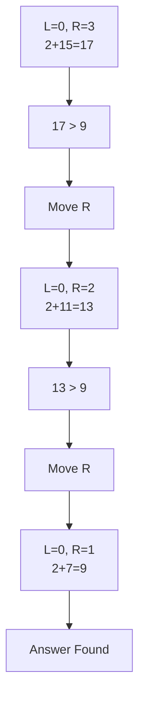

# 167. Two Sum II

## Idea

Since the array is sorted:

- If sum < target → move left pointer
- If sum > target → move right pointer
- If sum == target → answer found

## Dry Run

Array = [2,7,11,15]
Target = 9

## Complexity

- Time: O(n)
- Space: O(1)
